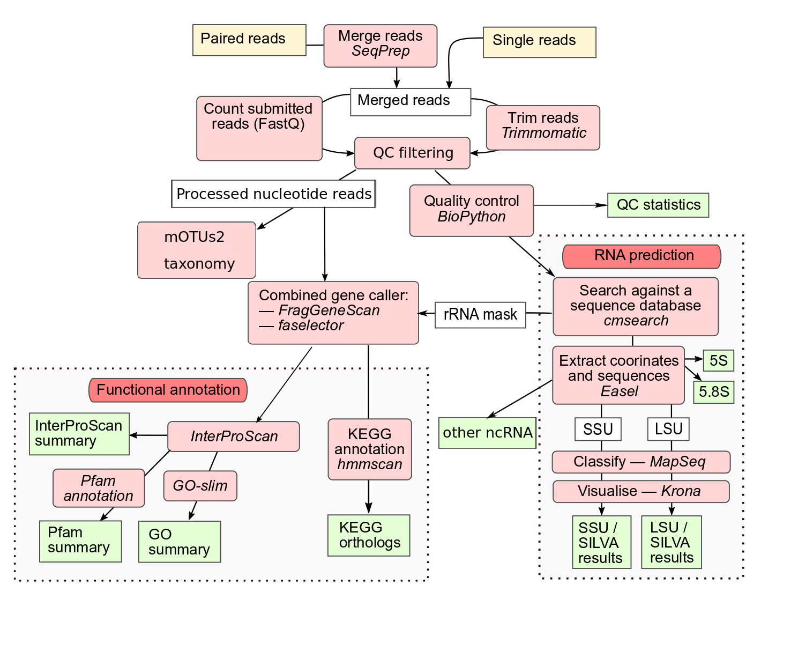

<a name="readme-top"></a>

<!-- PROJECT LOGO -->
<br />
<div align="center">
  <a href="https://galaxyproject.org/">
    
  </a>

<h2 align="center">Bachelor's Project </h2>
  <p align="center">
    Port, improve, and benchmark read-based MGnify analysis pipeline for microbiome data using the Galaxy framework
  <h4 align = "center"> by Albert Ratschinki </h4>
    <br />
    <a href="https://github.com/Alby-Git/bachelor-tools"><strong>Explore the docs »</strong></a>
    <br />
    <br />
    <a href="https://github.com/Alby-Git/bachelor-tools/tree/main/tools/mOTUs"><strong> mOTUs </strong></a> 
    ·
    <a href="https://github.com/Alby-Git/bachelor-tools/tree/main/tools/seqprep"><strong> SeqPrep </strong></a> 
    <br />
    <br />
    <a href="https://github.com/github_username/repo_name">SepPrep IUC</a>
    ·
    <a href="https://github.com/github_username/repo_name">mOTUs galaxy tools</a>
    ·
    <a href="https://github.com/Alby-Git/bachelor-tools/issues">Report Bug</a>
    ·
    <a href="https://github.com/Alby-Git/bachelor-tools/issues">Request Feature</a>
  </p>
</div>

<!-- TABLE OF CONTENTS -->
<details>
  <summary>Table of Contents</summary>
  <ol>
    <li>
      <a href="#about-the-project">About The Project</a>
      <ul>
        <li><a href="#built-with">Built With</a></li>
      </ul>
    </li>
    <li>
      <a href="#getting-started">Getting Started</a>
      <ul>
        <li><a href="#prerequisites">Prerequisites</a></li>
        <li><a href="#installation">Installation</a></li>
      </ul>
    </li>
    <li><a href="#usage">Usage</a></li>
    <li><a href="#roadmap">Roadmap</a></li>
    <li><a href="#contributing">Contributing</a></li>
    <li><a href="#license">License</a></li>
    <li><a href="#contact">Contact</a></li>
    <li><a href="#acknowledgments">Acknowledgments</a></li>
  </ol>
</details>


<!-- ABOUT THE PROJECT -->
## About The Project

<!--[![Product Name Screen Shot][product-screenshot]](https://galaxyproject.org/images/galaxy-logos/galaxy_project_logo.png)
-->

From October 16th to January 16th, I embarked on a bachelor's project as part of my Bachelor's degree at the Professorship for Bioinformatics. Supervised by [Paul Zierep](https://github.com/paulzierep), my task was to port, improve, and benchmark the read-based MGnify analysis pipeline for microbiome data using the Galaxy framework.

### Project Overview

Microbiome data analysis is a complex field, necessitating advanced computational tools and methodologies. My project centered on the [MGnify V5 Raw reads Pipeline](https://www.ebi.ac.uk/metagenomics/pipelines/5#raw), a well-regarded pipeline in microbiome data analysis.

A significant part of my project involved wrapping the tools [SeqPrep](https://github.com/jstjohn/SeqPrep) and [mOTUs3](https://github.com/motu-tool/mOTUs) (an updated version compared to mOTUs2 as illustrated in the image) for integration into the [Galaxy platform](https://galaxyproject.org/). This integration was crucial as it allows the full workflow of the MGnify V5 pipeline to be executed within Galaxy, making it accessible for a broader range of researchers and facilitating ease of use.

<br>
<div align="center" style="width: 80%; margin: auto;">
  <figure>
    <a href="https://www.ebi.ac.uk/metagenomics/pipelines/5#raw">
      
    </a>
    <figcaption>An illustration of the MGnify V5 pipeline</figcaption>
  </figure>
</div>


<p align="right">(<a href="#readme-top">back to top</a>)</p>


<!-- GETTING STARTED -->
## Getting Started

This is an example of how you may give instructions on setting up your project locally.
To get a local copy up and running follow these simple example steps.

### Prerequisites

This is an example of how to list things you need to use the software and how to install them.
* npm
  ```sh
  npm install npm@latest -g
  ```

<!-- USAGE  -->
## Usage

The tools and methodologies developed in this project can be applied in various ways to facilitate and enhance microbiome data analysis. Below are some examples of how these tools can be utilized within the Galaxy framework:

### Example Use Cases:

1. **Microbiome Data Preprocessing with SeqPrep:**
   - Utilize SeqPrep for the preprocessing of microbiome sequencing data. This includes steps like merging paired-end reads and quality filtering.
   - Example Workflow:    
      - After uploading your paired-end sequencing data to Galaxy, select SeqPrep from the tool menu.
      - Configure the tool parameters: specify the input files for forward and reverse reads, and set the merging and quality filtering parameters according to your experiment's requirements.
      - Execute the tool to process the data. The output will be a single, merged file of high-quality reads, ready for further analysis.

2. **Metagenomic Analysis with mOTUs:**
   - Deploy mOTUs for metagenomic profiling. This tool helps in identifying and quantifying microbial taxa in the sample data.
   - Example Workflow: 
      - Start with high-quality, preprocessed reads (e.g., output from SeqPrep).
      - Select mOTUs from the Galaxy tool menu.
      - Input your reads into mOTUs. You may need to specify certain      parameters, like the type of analysis (e.g., species-level profiling) or other advanced settings based on your study.
      Run the tool. mOTUs will output a detailed profile of the microbial community present in your sample.
      - This output can be visualized directly in Galaxy using available visualization tools or exported for further analysis.

### Integrating Tools in Galaxy:

- **Galaxy Environment:** 
  - [Galaxy](https://galaxyproject.org/) is an open, web-based platform for computational biomedical research. It allows users to reproduce and share analyses.
  - Within Galaxy, tools like SeqPrep and mOTUs can be integrated to streamline and simplify the microbiome data analysis pipeline.

### Additional Resources and Documentation:

- For detailed instructions, use cases, and tutorials on how to use these tools in Galaxy, please refer to the [Galaxy Training Network](https://training.galaxyproject.org/training-material/).


<p align="right">(<a href="#readme-top">back to top</a>)</p>


<!-- ROADMAP -->
## Roadmap

**Planemo**
- [x] **Install and Configure Planemo**
  - Setup Planemo environment on the system.
- [x] **Planemo Tutorial**
  - Complete introductory tutorials for understanding Planemo's functionalities.
- [x] **Planemo Documentation**
  - Extensive reading of the [Planemo Documentation](https://planemo.readthedocs.io/en/latest/index.html) to deepen understanding.

**SeqPrep**
- [x] **Understanding SeqPrep**
  - Research [SeqPrep](https://github.com/jstjohn/SeqPrep) tool and its mechanisms.
- [x] **Blueprint for SeqPrep**
  - Develop a plan for wrapping SeqPrep using Planemo.
- [x] **Implement SeqPrep in Galaxy**
  - Successfully wrap SeqPrep and demonstrate its functionality on Galaxy.
- [ ] **Contribute to IUC**
  - Prepare and submit a pull-request to integrate SeqPrep into the IUC main branch.

**mOTUs**
- [ ] **Explore mOTUs**
  - Learn about the mOTUs tool and its applications.
- [ ] **Plan mOTUs Integration**
  - Design a strategy for incorporating mOTUs into Galaxy.
- [ ] **Galaxy Implementation**
  - Execute the integration of mOTUs into the Galaxy platform.
- [ ] **Testing and Validation**
  - Ensure mOTUs works seamlessly within Galaxy; perform tests.

**mOTUs Data Manager**
- [ ] **Understand Data Manager Requirements**
  - Study the specific needs for a data manager for mOTUs.
- [ ] **Development Plan**
  - Draft a comprehensive plan for developing the mOTUs data manager.
- [ ] **Implementation**
  - Develop and integrate the data manager into the Galaxy ecosystem.
- [ ] **Optimization and Review**
  - Optimize for performance and user-friendliness; prepare for peer review.

For a full list of proposed features and known issues, see the [open issues](https://github.com/Alby-Git/bachelor-tools/issues).

<p align="right">(<a href="#readme-top">back to top</a>)</p>


<!-- CONTRIBUTING -->
## Contributing

Contributions are what make the open source community such an amazing place to learn, inspire, and create. Any contributions you make are **greatly appreciated**.

If you have a suggestion that would make this better, please fork the repo and create a pull request. You can also simply open an issue with the tag "enhancement".
Don't forget to give the project a star! Thanks again!

1. Fork the Project
2. Create your Feature Branch (`git checkout -b feature/AmazingFeature`)
3. Commit your Changes (`git commit -m 'Add some AmazingFeature'`)
4. Push to the Branch (`git push origin feature/AmazingFeature`)
5. Open a Pull Request
 
<p align="right">(<a href="#readme-top">back to top</a>)</p>


<!-- LICENSE -->
## License

Distributed under the MIT License. See `LICENSE.txt` for more information.

<p align="right">(<a href="#readme-top">back to top</a>)</p>


<!-- CONTACT -->
## Contact

Your Name - [@twitter_handle](https://twitter.com/twitter_handle) - email@email_client.com

Project Link: [https://github.com/github_username/repo_name](https://github.com/github_username/repo_name)

<p align="right">(<a href="#readme-top">back to top</a>)</p>


<!-- Planemo 101 -->
Instalation
Test
Serve

<!-- ACKNOWLEDGMENTS -->
## Acknowledgments

* []()
* []()
* []()

<p align="right">(<a href="#readme-top">back to top</a>)</p>

